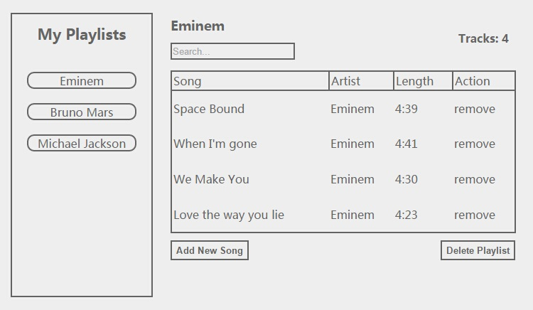
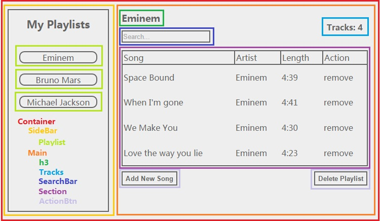

# Something about React.js - Jason Liao

2月份开始接触 [React.js](https://facebook.github.io/react/)，主要是为了之后学习 [React Native](https://facebook.github.io/react-native/) 但是现在开源的IOS端只能在OSX下才可以进行开发，然后Android端好像在10月份才开源

首先说一下我觉得学习 `React.js` 时的几个要点

1. 使用了类似`XML`的`JSX`语法来构建组件
2. `render()`、`getInitialState()`、`setState()`方法
3. `ref`属性(通过`this.refs.xxx.getDOMNode()`获得组件DOM节点)
4. 在组件里添加样式，或者用`className`定义类
5. `props` and `state`
6. **数据从父到子地传递，事件触发从子到父地传递**

## Getting Started

当然是到官网里看啦 [Getting Started](https://facebook.github.io/react/docs/getting-started.html)

##### What we need is  [Thinking in React](https://facebook.github.io/react/blog/2013/11/05/thinking-in-react.html)

里面说到，只要搞清了你要做的东西的结构，所以事情都变得很简单
下面我用一个小demo来解释一个上面的几个要点

## Playlist with React.js

完整代码在`playlist/`里，更多demo也可以到这里 [L-movingon/CodeBlock/Reactjs](https://github.com/L-movingon/CodeBlocks/tree/master/Reactjs) 查看

这就是我们最后出来的效果，现在我们要把他的结构弄清楚，这样就有助于我们的组件化

我把每个组件都用不同的色框了出来，也写下了对应颜色的组件名，也可以从中看到他们的父子关系
现在我们就可以开始写我们的代码了

#### 要点1

`React.js`用了`JSX`语法，所以我们在引入`JavaScript`的时候有一个地方需要注意
在`playlist/index.html`第20行，`type="text/jsx"`

同时我们在对body添加了一点点样式，还有创建一个`

`用来装载我们的`Container`组件

#### 要点2 `render()` 和要点4

在`render`这个函数里主要是`return`一些`HTML`标签来构建我们的组件，里面可以包含正常的`HTML`标签，也可以是我们自己构建的一些组件，同时也可以在里面定义`style`变量，用于对组件的样式修改，也可以用`className`来定义类。在构建组件的时候，可以传递一些我们自己定义的属性，并用`{}`来存放，至于`props`和`state`，我们后面会慢慢说到，当然啦，以上说的在官网里的 [Getting Started](https://facebook.github.io/react/docs/getting-started.html) 也会说到。

#### 要点5 和 要点2 `getInitialState()`、`setState()`

在创建组件的时候，我们传递的自己定义的所有属性就会被包裹成一个叫`props`的对象，这样我们就可以在组件里通过`this.props.xxx`来调用

那`state`对象又是什么呢，这个对象就是我们的`getInitialState()`这个函数返回的那个对象，这个函数里装载的属性都是一些会根据用户的操作而改变的一些属性。用户执行某个操作，把会影响到的属性放到`setState()`里更新值，然后`React`就会帮你执行DOM操作

#### 要点3

有时候我们需要获取、修改`DOM`节点里的值的时候，就可以为我们的`DOM`节点加一个`ref`属性，然后我们就可以通过`this.refs.xxx.getDOMNode()`得到`DOM`节点，然后进行`innerHTML`或者`value`等操作

#### 要点6

重点总是留到最后，**数据从父到子地传递，事件触发从子到父地传递**，怎么理解这句话，举个例子就知道

**事件触发从子到父地传递**

当我们点击左边`Playlist`的时候，有哪些组件发生了改变
`Main`里的`h3`、`Tracks`、`Section`

这时点击事件就要向父传递，传递到能够覆盖所有响应的组件的组件
`Playlist`向上到`SideBar`，`SideBar`不可以覆盖`Main`，继续往上
`SideBar`向上到`Container`，`Container`可以覆盖`Main`，ok
在`Container`里执行`setState()`，把用户选中的那个`data`对象更新

**数据从父到子地传递**

在`Contanier`里更新的那个对象用属性`playlist`传给`Main`，`Main`获得`this.props.playlist`对象

- `Main`用`this.props.playlist.playlistname`修改了`h3`
- `Main`用属性`tracks={this.props.playlist.tracks}`向下传给了`Tracks`
	- `Tracks`得到`this.props.tracks`，修改了`span`标签里`Tracks`的值
- `Main`用属性`data={this.props.playlist.data}`向下传给了`Section`
	- `Section`得到`this.props.data`，修改了表格里的值

## Summary
学习`React`的成本不高，只是不知道可以用他来做什么
下面分享一下一些个人觉得不错的关于`React`的文章

##### building robust web apps with react - Matt Hinchliffe

- [Part 1](http://maketea.co.uk/2014/03/05/building-robust-web-apps-with-react-part-1.html)
- [Part 2](http://maketea.co.uk/2014/04/07/building-robust-web-apps-with-react-part-2.html)
- [Part 3](http://maketea.co.uk/2014/05/22/building-robust-web-apps-with-react-part-3.html)
- [Part 4](http://maketea.co.uk/2014/06/30/building-robust-web-apps-with-react-part-4.html)

还有有很多入门的react-demo的repo

##### [ruanyf/react-demos](https://github.com/ruanyf/react-demos)

还有一些 React 的教程视频 还有 React.js Conf 2015 全部视频！:heart_eyes: 找我要！！！

